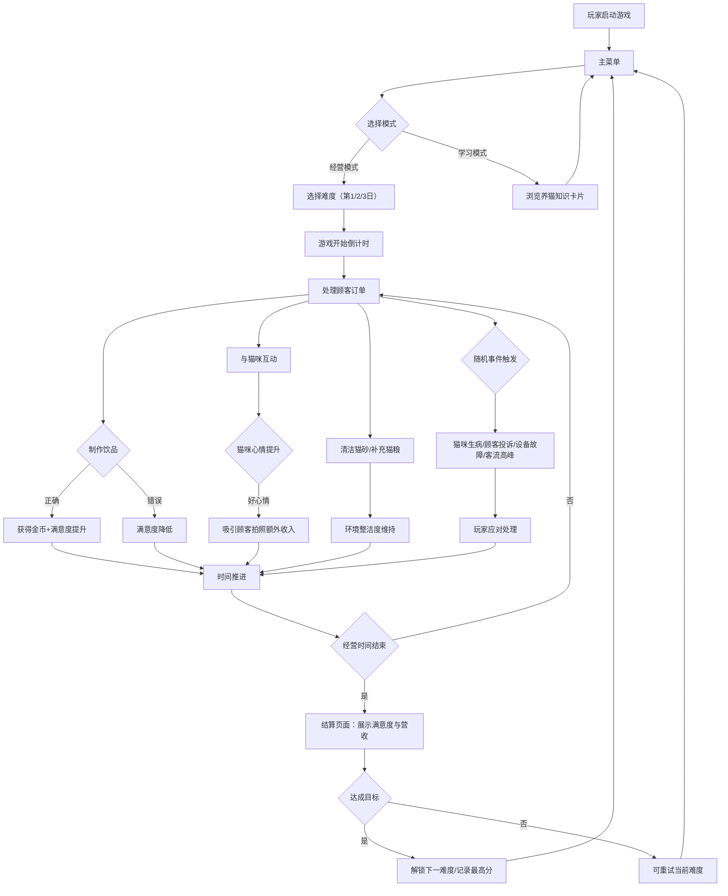

## 1. 产品概述

猫咪咖啡馆经营与顾客满意度挑战游戏 —— 玩家扮演猫咪咖啡馆店主，通过照料猫咪、制作饮品、维护环境来经营咖啡馆，追求高顾客满意度与营收。

- 目标用户：休闲游戏爱好者、猫咪爱好者、模拟经营游戏玩家
- 产品价值：寓教于乐，在轻松游戏氛围中学习养猫知识，锻炼资源管理与多任务处理能力

## 2. 核心功能

### 2.1 用户角色
| 角色 | 注册方式 | 核心权限 |
|------|----------|----------|
| 店主（玩家） | 本地启动即玩 | 经营咖啡馆、照料猫咪、制作饮品、查看学习资料 |

### 2.2 功能模块
1. **主菜单页**：开始游戏、难度选择、最高分记录、养猫知识学习模式、游戏说明
2. **游戏主场景**：猫咪互动区、饮品制作台、清洁区域、顾客等待区、实时状态栏
3. **结算页面**：当日满意度、营收统计、星级评价、是否解锁下一关
4. **学习模式页**：养猫知识卡片展示、分类浏览

### 2.3 页面详情
| 页面名称 | 模块名称 | 功能描述 |
|----------|----------|----------|
| 主菜单页 | 难度选择 | 3个难度递进的经营日（新手日、忙碌日、挑战日） |
| 主菜单页 | 最高分记录 | 本地存储历史最佳分数，按难度分别展示 |
| 主菜单页 | 学习模式入口 | 进入养猫知识学习界面 |
| 游戏主场景 | 猫咪情绪系统 | 4只猫咪各有情绪条（饥饿/心情/健康），互动喂食抚摸可提升 |
| 游戏主场景 | 顾客等待队列 | 顾客排队显示订单（饮品+猫咪互动需求），超时会离开降低满意度 |
| 游戏主场景 | 饮品制作系统 | 选择配方（咖啡豆/抹茶/奶茶基底）、温度（热/冰/温），正确匹配订单得分 |
| 游戏主场景 | 环境维护系统 | 猫砂清洁、猫粮补充，环境脏乱降低顾客满意度 |
| 游戏主场景 | 随机事件 | 猫咪生病、顾客投诉、咖啡机故障、节假日客流高峰 |
| 游戏主场景 | 实时状态栏 | 猫咪情绪条汇总、顾客等待数、满意度百分比、营收金额、剩余时间 |
| 结算页面 | 统计面板 | 展示当日满意度、营收、服务顾客数、正确饮品数、星级评价 |
| 学习模式页 | 知识卡片 | 分类展示养猫知识（饮食、健康、行为、环境），点击翻转查看详情 |

## 3. 核心流程

## 4. 用户界面设计

### 4.1 设计风格
- **主色调**：暖橘色 #F5A65B（猫咪主题）搭配奶油白 #FFF8F0 作为背景
- **辅助色**：抹茶绿 #88B04B（健康/正面）、玫瑰粉 #E8B4B8（心情/猫咪）、深棕 #6B4423（文字/边框）
- **按钮风格**：圆角胶囊型按钮，带 3D 轻微凸起阴影，悬停时上浮 2px
- **字体**：标题使用圆润可爱的 "ZCOOL KuaiLe"，正文使用清晰易读的 "Noto Sans SC"
- **布局风格**：顶部状态栏 + 中央游戏区（左侧猫咪区、中央顾客区、右侧操作面板）+ 底部任务栏
- **图标/emoji**：大量使用 🐱☕🥛🍵 等 emoji 配合游戏氛围，图标采用线条圆润风格

### 4.2 页面设计概览
| 页面名称 | 模块名称 | UI 元素 |
|----------|----------|---------|
| 主菜单页 | 标题区 | 大号卡通猫咪咖啡馆标题，漂浮动画的猫咪剪影装饰 |
| 主菜单页 | 按钮区 | 垂直排列的圆角大按钮（开始游戏/学习模式/最高分），渐变色填充 |
| 游戏主场景 | 顶部状态栏 | 横向排列：⏰剩余时间、😊满意度%、💰营收、🐱猫咪状态图标，圆角卡片式 |
| 游戏主场景 | 左侧猫咪区 | 4只猫咪卡片，每只含头像、名字、情绪条（红/黄/绿渐变），可点击互动 |
| 游戏主场景 | 中央顾客区 | 顾客排队队列，每位顾客显示头像、订单气泡、等待时间条 |
| 游戏主场景 | 右侧操作面板 | 饮品制作台（配方选项、温度选项、确认按钮）、清洁按钮 |
| 游戏主场景 | 底部任务栏 | 快速操作按钮、事件提示滚动条 |
| 结算页面 | 成绩展示 | 大号星级评价（⭐⭐⭐）、满意度进度环、营收数字翻牌动画 |
| 学习模式页 | 知识卡片 | 3列网格布局，卡片悬停翻转动画，正反面信息展示 |

### 4.3 响应式
桌面端优先设计（1280x720 基准），游戏画布固定比例自适应缩放，触摸操作区域保持足够间距。

### 4.4 动画与反馈
- 猫咪心情好时会有弹跳动画 + 心形粒子特效
- 饮品制作正确时出现绿色 ✔ 对勾粒子
- 顾客满意离开时挥手动画 + 金币飞入动画
- 随机事件触发时屏幕边缘闪烁对应颜色警告
- 所有按钮点击有缩放反馈
