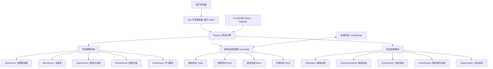
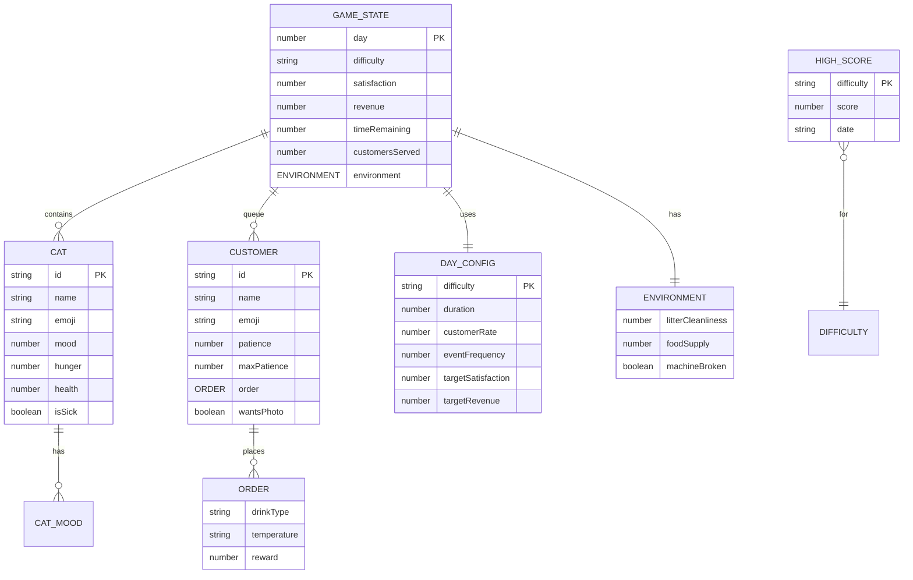

## 1. 架构设计



## 2. 技术描述
- **前端框架**：React 18 + TypeScript 用于 UI 组件（菜单、学习模式、HUD）
- **游戏引擎**：Phaser.js 3.x 用于游戏场景、精灵、动画、粒子特效
- **构建工具**：Vite 5.x（端口 9401）
- **样式**：Tailwind CSS 3.x
- **状态管理**：Zustand（游戏全局状态）
- **数据存储**：LocalStorage（最高分、游戏进度）
- **后端**：无（纯前端游戏）

## 3. 路由定义
| 路由 | 用途 |
|------|------|
| / | 主入口，渲染游戏容器 |
| /#menu | 主菜单场景（由 Phaser 场景管理） |
| /#game | 游戏主场景 |
| /#result | 结算场景 |
| /#learn | 学习模式场景 |

## 4. 数据模型

### 4.1 数据模型定义



### 4.2 TypeScript 类型定义

```typescript
// 猫咪相关类型
export type DrinkType = 'coffee' | 'matcha' | 'milkTea' | 'cappuccino';
export type Temperature = 'hot' | 'ice' | 'warm';
export type Difficulty = 'easy' | 'normal' | 'hard';
export type SceneKey = 'Boot' | 'Menu' | 'Game' | 'Result' | 'Learn';

export interface Cat {
  id: string;
  name: string;
  emoji: string;
  mood: number;
  hunger: number;
  health: number;
  isSick: boolean;
}

export interface Order {
  drinkType: DrinkType;
  temperature: Temperature;
  reward: number;
}

export interface Customer {
  id: string;
  name: string;
  emoji: string;
  patience: number;
  maxPatience: number;
  order: Order;
  wantsPhoto: boolean;
  photoCatId?: string;
}

export interface Environment {
  litterCleanliness: number;
  foodSupply: number;
  machineBroken: boolean;
  machineRepairTime: number;
}

export interface DayConfig {
  difficulty: Difficulty;
  dayName: string;
  duration: number;
  customerSpawnRate: number;
  eventFrequency: number;
  targetSatisfaction: number;
  targetRevenue: number;
  catDecayRate: number;
  description: string;
}

export interface GameState {
  day: number;
  difficulty: Difficulty;
  satisfaction: number;
  revenue: number;
  timeRemaining: number;
  customersServed: number;
  correctDrinks: number;
  cats: Cat[];
  customers: Customer[];
  environment: Environment;
  isPaused: boolean;
  isHoliday: boolean;
}

export interface HighScore {
  difficulty: Difficulty;
  score: number;
  revenue: number;
  satisfaction: number;
  date: string;
}

export interface CatKnowledge {
  id: string;
  category: 'diet' | 'health' | 'behavior' | 'environment';
  categoryName: string;
  title: string;
  content: string;
  emoji: string;
}
```

## 5. 项目结构

```
/
├── src/
│   ├── game/                    # Phaser 游戏相关
│   │   ├── scenes/              # 游戏场景
│   │   │   ├── BootScene.ts
│   │   │   ├── MenuScene.ts
│   │   │   ├── GameScene.ts
│   │   │   ├── ResultScene.ts
│   │   │   └── LearnScene.ts
│   │   ├── systems/             # 游戏系统
│   │   │   ├── CatSystem.ts
│   │   │   ├── CustomerSystem.ts
│   │   │   ├── DrinkSystem.ts
│   │   │   ├── EventSystem.ts
│   │   │   └── CleanSystem.ts
│   │   ├── config/              # 配置数据
│   │   │   ├── dayConfigs.ts
│   │   │   ├── catData.ts
│   │   │   ├── drinkRecipes.ts
│   │   │   └── knowledgeData.ts
│   │   └── types/
│   │       └── game.ts          # 游戏类型定义
│   ├── store/                   # Zustand 状态
│   │   └── gameStore.ts
│   ├── components/              # React UI 组件
│   │   ├── HUD/
│   │   │   ├── TopBar.tsx
│   │   │   ├── CatPanel.tsx
│   │   │   ├── CustomerQueue.tsx
│   │   │   └── DrinkMaker.tsx
│   │   ├── Menu/
│   │   │   ├── MainMenu.tsx
│   │   │   └── DifficultySelect.tsx
│   │   ├── Result/
│   │   │   └── ResultPanel.tsx
│   │   └── Learn/
│   │       ├── KnowledgeCard.tsx
│   │       └── LearnPanel.tsx
│   ├── utils/
│   │   ├── storage.ts           # LocalStorage 工具
│   │   └── helpers.ts
│   ├── App.tsx
│   ├── main.tsx
│   └── index.css
├── public/
├── index.html
├── package.json
├── tsconfig.json
├── vite.config.ts               # 配置端口 9401
├── tailwind.config.js
└── postcss.config.js
```
